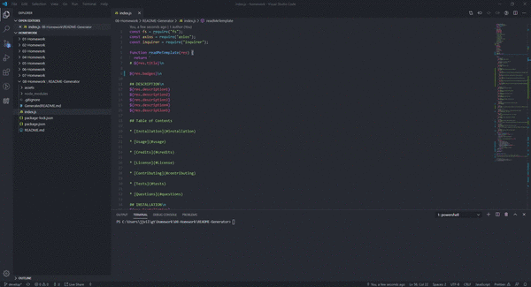

# README-Generator

[](https://github.com/noobatl/README-Generator) [](https://www.npmjs.com/) [](https://nodejs.org/en/) [](https://www.mit.edu/~amini/LICENSE.md) [](code_of_conduct.md)

## Description

Do you ever get tired of having to construct a new README.md file for every project you write? Sometimes the simple task of explaining what, why and how you developed a project is a grueling task. The README-Generator was built specifically for this reason, to make it easier to construct a README file without having to put the extra effort all the time. 

This project was built to ask the user relevant questions they might forget when building a new repo. It solves the question "Did I forget to put something in my README file?" by asking simple questions used to build a lengthy, well constructed README. 

In making this generator, I learned some valuable tools in node.js, such as, appending files, modularization, npm, arrow functions, let scope, constant referencing, functional loops, template literals, rest, spread, callback and object destructuring. 

This project is unique because it was built from scratch and will be updated everytime I write a new project. It will continue to get better over time. 

## Table of Contents

* [Installation](#installation)

* [Usage](#usage)

* [Credits](#credits)

* [License](#License)

* [Contributing](#contributing)

* [Tests](#tests)

* [Questions](#questions)

## Installation

To install necessary dependencies, run the following command: 

```
npm install

```

## Usage 

To use the generator, type in the followin command and then answer all the questions, or press enter to use default for appicable questions. See gif below for quick instructions.

```
node index.js

```


## Credits

No collaborators in this version of README-Generator. 

## License

MIT License

Copyright (c) 2020

Permission is hereby granted, free of charge, to any person obtaining a copy of this software and associated documentation files (the "Software"), to deal in the Software without restriction, including without limitation the rights to use, copy, modify, merge, publish, distribute, sublicense, and/or sell copies of the Software, and to permit persons to whom the Software is furnished to do so, subject to the following conditions: The above copyright notice and this permission notice shall be included in all copies or substantial portions of the Software. THE SOFTWARE IS PROVIDED "AS IS", WITHOUT WARRANTY OF ANY KIND, EXPRESS OR IMPLIED, INCLUDING BUT NOT LIMITED TO THE WARRANTIES OF MERCHANTABILITY, FITNESS FOR A PARTIC AUTHORS OR COPYRIGHT HOLDERS BE LIABLE FOR ANY CLAIM, DAMAGES OR OTHER LIABILITY, WHETHER IN AN ACTION OF CONTRACT, TORT OR OTHERWISE, ARISING FROM, OUT OF OR IN CONNECTION WITH THE SOFTWARE OR THE USE OR OTHER DEALINGS IN THE SOFTWARE.

## Contributing

Please note that this project is released with a Contributor Code of Conduct. By participating in this project you agree to abide by its terms.

## Tests

To run tests, run the following command: 

```
npm test
```

## Questions


If you have any questions about this repo, open an issue or contact [JJ Villacres](https://api.github.com/users/noobatl) directly at info@noobusa.com.

